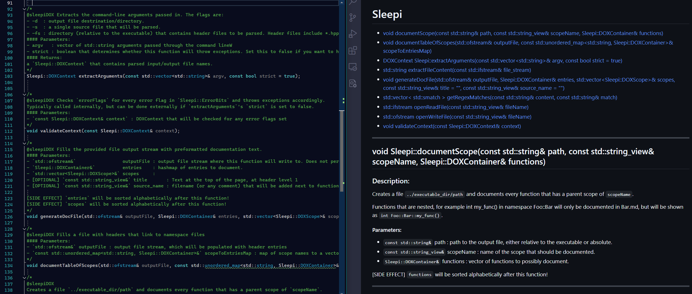

# SleepiDOX
[](https://opensource.org/licenses/MIT)


### About:
A tool to help easily turn existing comments within C/C++ header files into documentation in the form of markdown files. The comments are directly translated to markdown, so it's simple, and easy to customize. 


<center><small>Example of how the source code comments get documented.</small></center>

- - -

### Roadmap:
- [ ] Make the `@sleepiDOX` token customizable
- [ ] Add a way to parse `#define`, `using`, and `typedef`
- [ ] Add an option to parse member variables.
- [ ] General code cleanup, possible update to C++20, or downgrade to C++14, to increase availability.
---


### Examples:

Examples of how each flag works will be in the [Examples](/Examples/) folder.

A small example of how files are produced is as follows:

```
// example.hpp

class Foo {
    size_t x, y;
public:
    // @sleepiDOX Sets the `x` member variable to `val`
    void set_x(const size_t& val);

    // @sleepiDOX Sets the `y` member variable to `val`
    void set_y(const size_t& val);

    // @sleepiDOX Returns the sum of both member variables `x`, and `y`
    size_t sum() noexcept;

    // Don't wanna show this one
    char* _SHA265(const char* INPUT, const size_t length);
};
```
After running `sleepiDOX.exe -f example.hpp` would produce [this](/Examples/Basic%20Usage/-f/).

<br>
<br>
Another example of how files are created is demostrated here
<br>
<br>

```
C:
├─ sleepiDOX
│   ├── sleepiDOX.exe
│   └── woohoo.hpp
│ 
├── Source/
│   ├── Headers/
│   │   ├── something.hpp
│   │   └── another.hpp
│   ├── something.cpp
│   ├── another.cpp
│   ├── main.cpp
.
```
```
C:\sleepiDOX> .\sleepiDOX.exe -fs ..\Source\Headers\
```
Now every namespace (namespace, struct, class) within `something.hpp` and `another.hpp` has had their functions / methods documented in `SomeNamespace.md`, and `SomeOtherStruct.md`.

**Note:** If a namespace does not contain any documented functions, then it will not have its own separate markdown file. 
```
C:
├── sleepiDOX
│   ├── sleepiDOX.exe
│   ├── woohoo.hpp
│   ├── SomeNamespace.md
│   ├── SomeOtherStruct.md
│   └── TableOfEntries.md
│ 
├── Source/
│   ├── Headers/
│   │   ├── something.hpp
│   │   └── another.hpp
│   ├── something.cpp
│   ├── another.cpp
│   ├── main.cpp
.
```

- - -
### Build:

#### Visual Studio (only tested 2022)
- Open `sleepiDox.sln`
- Go to *Project* -> *sleepiDOX Properties* -> *Debugger*
- Set *Command Arguments* as needed.
- Build and Run
<br>
<br>
<br>
#### CMAKE
Move current directory to the `build` folder
```
C:\..\..\sleepiDOX> cd build
```
Run the `CMakeLists.txt` from the build directory
```
C:\..\..\sleepiDOX\build> cmake ../
```
On windows `build` should now contain 3 solutions. Set `sleepiDOX.sln` as startup project, and run in Visual Studio.

On Unix it should generate a `make` file which you can run in the terminal. *(Untested)*
<br>
<br>
- - -
### Flags

Flags can be appended in any order, and depending on the flag - with or without an additional argument.
```
.\sleepiDOX.exe -fs [DIRECTORY] -f [FILE_PATH] -d {FILE_PATH}
```
- **-fs** [DIRECTORY] : Sets the source file directory. Each header file within [DIRECTORY] will be parsed.
If no [DIRECTORY] is provided, it will default to the executable's directory.

*Note:* [DIRECTORY] must end in a slash `/` on Windows, and `\` on Unix. Absense of this slash will result in undefined behavior.
- **-f** {FILE_PATH} : Will parse and document only the provided file. {FILE_PATH} must be provided, otherwise the program will fail.

- **-d** {FILE_PATH} : Will force the documentation to output both the table of entries along with each function into one file (unlike each namespace having its own file). {FILE_PATH} must be provided, otherwise the program will fail.

- - Either `-fs` or `-f` is required for the program to work.
<br>
<br>
- - -
### Contributing
sure go ahead